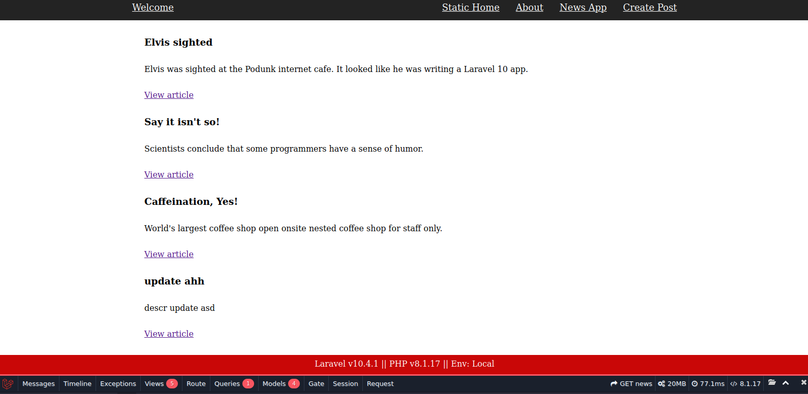

# Laravel 10.4.1 - Build a simple News website

## About the project

To learn Laravel was made CRUD with News.

with similar struture or same idea of:

[CodeIgniter 4 - Build Your First Application](https://github.com/ampmonteiro/ci4-build-your-first-App)

on my repo.

### Image:



### Docs:

https://laravel.com/docs/10.x

### Install framework

```bash
    composer create-project laravel/laravel:^10.0 ./
```

### install debug toolbar

```bash
    composer require barryvdh/laravel-debugbar --dev
```

## Editor and Recommend extensions

- Editor: [VS Code](https://code.visualstudio.com) (By Microsoft)

- [PHP Intelephense](https://marketplace.visualstudio.com/items?itemName=bmewburn.vscode-intelephense-client) (By Ben Mewburn)

- [PHP Namespace Resolver](https://marketplace.visualstudio.com/items?itemName=MehediDracula.php-namespace-resolver) (By Mehedi Hassan)

- [PHP Awesome Snippets](https://marketplace.visualstudio.com/items?itemName=hakcorp.php-awesome-snippets) (By HakCorp)

- [Blade Syntax for PHP](https://marketplace.visualstudio.com/items?itemName=NamesMT.blade-php) (by Trung Dang)

- [Laravel Blade Snippets](https://marketplace.visualstudio.com/items?itemName=onecentlin.laravel-blade/) (by Winnie Lin )

- [Laravel Blade Spacer](https://marketplace.visualstudio.com/items?itemName=austenc.laravel-blade-spacer) (by Austen Cameron)

- [Laravel goto view](https://marketplace.visualstudio.com/items?itemName=codingyu.laravel-goto-view) (by codingyu )

- [aravel intellisense](https://marketplace.visualstudio.com/items?itemName=mohamedbenhida.laravel-intellisense) (by Mohamed Benhida)

- To better developement it is taked advantages of this two wonderfull vscode extensions:
  - [Docker](https://marketplace.visualstudio.com/items?itemName=ms-azuretools.vscode-docker) (By Microsoft): to manage docker containers in vs code
  - [Dev Containers](https://marketplace.visualstudio.com/items?itemName=ms-vscode-remote.remote-containers) (By Microsoft): to use vscode inside of the container.

## Setup (using docker without compose)

php image: read the Dockerfile

mysql image in terminal:

```bash

docker run --name db_sf \
     -e MYSQL_ROOT_PASSWORD=[your pwd] \
     -e MYSQL_DATABASE=sf6 \
     -e MYSQL_USER=[youur user] \
     -e MYSQL_PASSWORD=[your password] \
     -dp 3306:3306 mysql;
```
